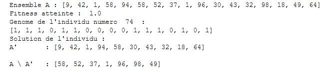

# Algorithme-Evolutionnaire
Création d'un algorithme évolutionnaire pour le partionnement d'un ensemble en deux sous emsembles de même somme.

On adapte un algorithme génétique simple à un problème assez complexe tel que le MaxOne, c'est à dire, le problème de la partition, qui est un problème NP-Complet.

<!-- TABLE OF CONTENTS -->

  
Table of Contents

  <ol>
    <li>
      <a href="#about-the-project">About The Project</a>
      <ul>
        <li><a href="#problem">Problem</a></li>
      </ul>
      <ul>
        <li><a href="#output">Output</a></li>
      </ul>
       <ul>
        <li><a href="#details">Details</a></li>
      </ul>
    </li>
  </ol>

<!-- ABOUT THE PROJECT -->
## About The Project
Ce problème a été démontré être NP-complet, même si il peut être résolu en temps pseudopolynomial par programmation dynamique.
Nous essayons donc par cet algorithme de trouver une solution qui sur de grands ensembles s'avère plus performant. 

### Problem

* Le problème de la partition, en tant que problème de décision, peut être énoncé comme suit : étant donné un ensemble fini A et une taille t(a) appartenant à N \ 0 pour chaque a de A, existe-t-il un sous-ensemble A' issu de A tel que :

### Output
* Prenons l'Output suivant et analysons le : 
 

* Nous avons tout d'abord l'ensemble A qui a été défini de manière aléatoire (sa taille et ses valeurs sont tirées aléatoirement)
* La fitness atteinte correspond à celle de l'individu juste en dessous (dans notre problème, la fitness max possible est 1)
* Le génome de l'individu représente la solution trouvé. Les 1 définisse les valeurs de A' piochée dans A, à la position correspondante et les 0 les valeurs qui seront dans A privé de A'
* La solutions de partitionnement de A en A' et A \ A' est donc renvoyée ensuite. 

### Details

* Dans un premier temps, l'algorithme génère A de façon aléatoire (taille aléatoire de A = N = longueur d'un génome de la population)
* Ensuite, il génère une population "pop" de taille POPSIZE (nombre d'individus fixé au début), et dont chaque individu a un génome de taille N (soit len(A)), on obtient donc notre population de dimansion N x POPSIZE
* L'algorithme va séparer A en fonction du génôme chaque individus et faire la somme des éléments de chaque sous ensemble 
* sum(A') = sum(A x pop[i])  &  sum(A \ A') = sum(A - A')
Exemple : 
A      = 1 2 3 4 5 6
pop(i) = 0 1 1 0 0 0
Alors:
A'     = 0 2 3 0 0 0
A \ A' = 1 0 0 4 5 6
Et:
sum(A')= 5
sum(A \ A') = 16
* Enfin, l'algorithme fait la différence entre ces deux valeurs, et l'utilise pour calculer la fitness (fitness = 1/(1+z(ind), z(ind) étant la différence entre les poids des deux sous ensembles)
* On test tous les individus de la population tant qu'on a pas une fitness égale à 1
* A la fin de la génération i, on applique la mutation et la recombinaison des génomes pour tester de nouvelles combinaisons (créer de nouveaux individus, faire de la reproduction)
* On génère une nouvelle génération tant qu'on a pas atteint une fitness de 1 pour un individu de la génération i
* Si on atteind pas une fitness de 1, on s'arrête à la génération MAXGEN, qui est le nombre max de génération à tester.
* On renvoie dans ce cas là, la fitness max de l'individu de la dernière génération
* On pourrait donc améliorer l'algorithme en stockant l'individu ayant eu la meilleure fitness dans les générations précédentes, au cas où on ne trouve pas de solution optimale.
