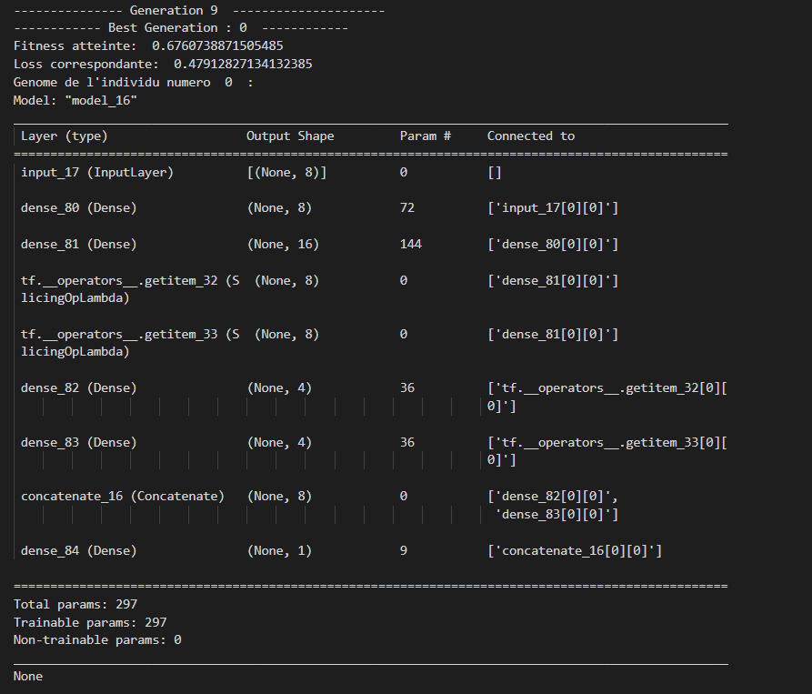
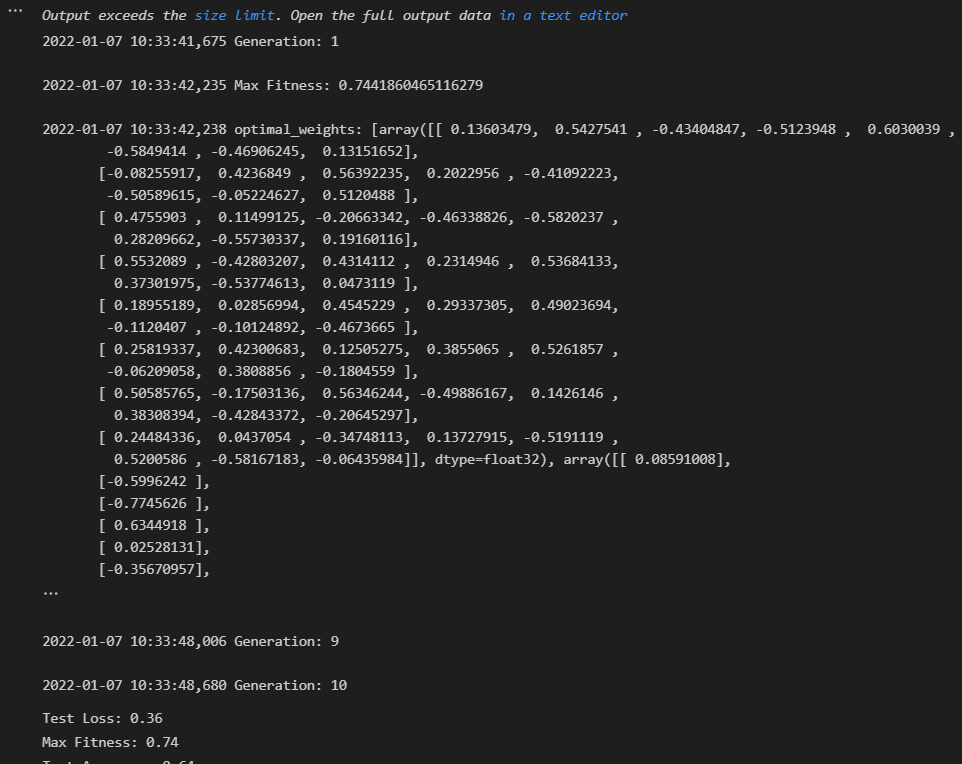

# Algorithme-Evolutionnaire
Création d'un algorithme évolutionnaire pour le partionnement d'un ensemble en deux sous emsembles de même somme.
* **AE_TP7_test.ipynb** est un fichier détaillé des tests et recherches faites dans un premier temps. Il y a donc un premier algorithme (un peu brouillon) mais fonctionnel.
* **AE_TP7_Finale.ipynb** contient quant à lui l'algorithme final avec de meilleurs résultats. 
* Les deux fichiers étant des Jupyter Notebook, le détail et les commentaires s'y trouvent. 

<!-- TABLE OF CONTENTS -->

  
Table of Contents

  <ol>
    <li>
      <a href="#about-the-project">About The Project</a>
      <ul>
        <li><a href="#introduction">Introduction</a></li>
      </ul>
      <ul>
        <li><a href="#neuroevolution-of-augmenting-topologies"> Neuroevolution </a></li>
      </ul>
       <ul>
        <li><a href="#results">Results</a></li>
      </ul>
    </li>
  </ol>

<!-- ABOUT THE PROJECT -->
# Algorithmes Évolutionnaires — Travaux dirigés N◦6 : neuroévolution
## About The Project
Dans cette séance, nous allons développer un algorithme évolutionnaire du type NEAT pour optimiser un réseau de neurones. Pour ce faire, nous utiliserons les frameworks DEAP et Keras.

### Introduction
Pour appliquer **les algorithmes évolutionnaires aux réseaux de neurones**, il y a deux possibilités : soit on code soi-même les primitives du réseau de neurones, soit on s’appuye sur un frameworks, comme **Keras**, qui fournit toutes ces primitives et plein de choses en plus. 
Dans les deux cas, il y a des avantages et des inconvénients : 
* si on décide de coder soi-même, il faudra investir du temps dans le développement, mais on aura un contrôle et une compréhension parfaite sur le code produit ; 
* si on opte pour un framework, il faudra investir du temps pour apprendre à l’utiliser, mais on aura accès à tout ce qu’il y a de plus récent et performant en matière d’apprentissage profond

-------------------------------------------------------------- 

class = Variable de classe (1:test positif pour le diabète, 0 : test négatif pour le diabète)

### NeuroEvolution of Augmenting Topologies
- Démarrer avec des topologies aléatoires minimales.
- Augmenter les topologies au fur et à mesure si nécessaire.
- Suivez les gènes correspondants pour atténuer le problème des conventions concurrentes.
- Protéger les innovations par la spéciation.

**La fonction de fitness** sera basée sur la **fonction de perte** du réseau de neurones.
Une fonction de perte, ou **Loss function**, est une fonction qui **évalue l’écart entre les prédictions réalisées par le réseau de neurones et les valeurs réelles des observations utilisées pendant l’apprentissage**. Plus le résultat de cette fonction **est minimisé**, plus le réseau de neurones **est performant**. Sa minimisation, c’est-à-dire réduire au minimum l’écart entre la valeur prédite et la valeur réelle pour une observation donnée, se fait en ajustant les différents poids du réseau de neurones.

### Results
* Prenons l'Output du premier algorithme contenu dans AE_TP7_test.ipynb : 

* Prenons l'Output du second algorithme contenu dans AE_TP7_finale.ipynb : 

